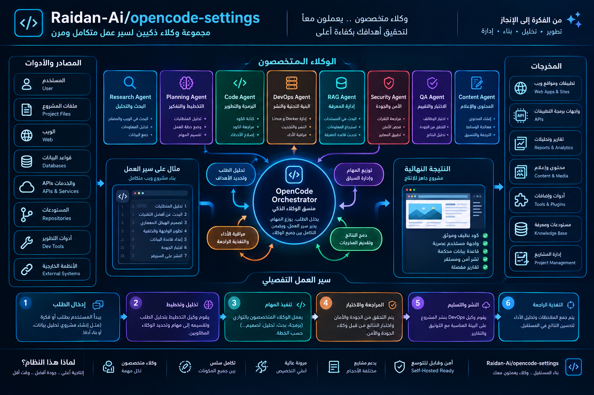

<div dir="rtl" lang="ar">



# OpenCode codedata


مستودع مُنظَّم ومُتحكَّم بإصداراته يحتوي على **وكلاء** و**مهارات** و**أوامر**
و**سياق** و**أدوات** و**إضافات** خاصة بـ OpenCode — مع مُثبِّتين جاهزين
لنظامي لينكس/ماك (`install.sh`) وويندوز (`install.ps1`).

> **الفهرس**
>
> - [المميزات](#المميزات)
> - [هيكل المستودع](#هيكل-المستودع)
> - [البدء السريع](#البدء-السريع)
> - [خيارات المُثبِّت](#خيارات-المثبت)
> - [لوحة التحكم](#لوحة-التحكم)
> - [متغيرات البيئة](#متغيرات-البيئة)
> - [مواقع التثبيت](#مواقع-التثبيت)
> - [التحقق من التثبيت](#التحقق-من-التثبيت)
> - [التحديث](#التحديث)
> - [إلغاء التثبيت](#إلغاء-التثبيت)
> - [المساهمة](#المساهمة)
> - [الأمان](#الأمان)
> - [استكشاف الأخطاء](#استكشاف-الأخطاء)
> - [الأسئلة الشائعة](#الأسئلة-الشائعة)
> - [الترخيص](#الترخيص)

---

## المميزات

| المجال | العدد | الوصف |
|--------|------:|-------|
| **الوكلاء** | 50 | وكلاء فرعيون: Planner و Worker و Reviewer بالإضافة إلى مهندسين متخصصين (أمن، قواعد بيانات، واجهات أمامية، سحابة، DevOps، NVIDIA…). |
| **مهارات OpenCode** | 47 | مجموعة مهارات OpenCode الرسمية (هندسة البرمجيات، السحابة، الواجهات، الخلفيات، قواعد البيانات، الأمن…). |
| **مهارات NVIDIA** | 363 | مهارات NVIDIA التي تغطي DOCA و DeepStream و Holoscan و Jetson و cuOpt و cuDF و NeMo و TAO و Dynamo و VSS ومخططات RAG والمزيد. |
| **الأوامر** | 12 | أوامر شرطة مائلة قابلة لإعادة الاستخدام. |
| **السياق** | 176 | ملفات سياق مشتركة لسلوك وكيل متسق. |
| **الأدوات** | 2 | أدوات إضافية (`env`، `gemini`). |
| **الإضافات** | 1 | إضافة `notify`. |
| **إجمالي الملفات** | ~5,600 | كل شيء في مستودع git واحد. |

- **لوحة تحكم بدون أي تبعيات** — واجهة ويب محلية يقدمها Node، دون `npm install`.
- **وضع التجربة الجافة (Dry-run)** — معاينة كل إجراء قبل لمس القرص.
- **نسخ احتياطية تلقائية** — إعداداتك الحالية لا تُحذف أبدًا.
- **متعدد المنصات** — نفس الميزات على يونكس وويندوز.

## هيكل المستودع

```
codedata/
├── agents/               # 50 تعريفًا للوكلاء
├── commands/             # 12 أمرًا
├── config/               # بيانات وصفية للوكلاء
├── context/              # 176 ملف سياق
├── dashboard/            # لوحة تحكم محلية بدون تبعيات
│   ├── server.js         # خادم Node HTTP (المنفذ 8877)
│   └── public/           # أصول ثابتة
├── plugins/              # إضافة notify
├── skills/
│   ├── opencode/         # 47 مهارة OpenCode
│   └── nvidia/           # 363 مهارة NVIDIA
├── tools/                # أدوات env + gemini
├── env.example           # قالب متغيرات البيئة
├── AGENTS.md             # تعليمات للوكلاء البرمجيين (تثبيت تلقائي)
├── install.ps1           # مُثبِّت ويندوز (PowerShell)
├── install.sh            # مُثبِّت لينكس/ماك
├── opencode.jsonc        # إعداد OpenCode
├── package.json
└── skill-lock.json       # إصدارات المهارات المثبَّتة
```

## البدء السريع

### لينكس / ماك

```bash
git clone https://github.com/Raidan-Ai/opencode-settings.git codedata
cd codedata
bash install.sh
```

### ويندوز (PowerShell)

```powershell
git clone https://github.com/Raidan-Ai/opencode-settings.git codedata
cd codedata
powershell -ExecutionPolicy Bypass -File .\install.ps1
```

بعد التثبيت:

1. انسخ `env.example` إلى `.env`.
2. ضع رموز المزودين الحقيقية (انظر [متغيرات البيئة](#متغيرات-البيئة)).
3. شغّل `opencode` — وكلاؤك ومهاراتك جاهزة.
4. (اختياري) شغّل لوحة التحكم: `node dashboard/server.js`.

## خيارات المُثبِّت

### `install.sh`

| الخيار | الوصف |
|--------|-------|
| `--help` | عرض المساعدة والخروج |
| `--dry-run` | معاينة كل إجراء دون تعديل أي شيء |
| `--uninstall` | نسخ احتياطي ثم إزالة الإعداد المثبَّت |
| `--no-dashboard` | تخطي لوحة التحكم |
| `--no-backup` | تخطي النسخ الاحتياطي للإعداد الحالي |
| `--force` | الكتابة فوق الملفات دون تأكيد |
| `--prefix <dir>` | تثبيت إعداد opencode تحت `<dir>/.config/opencode` (تبقى الوكلاء والمهارات في `~/.agents`) |
| `--mode <mode>` | forz mode: full | update | uninstall | preview |
| `--components <a,b,c>` | القائمة الفرعية المفصولة بفواصل: agents,skills,commands,context,config,plugins,tools,dashboard,plugindeps |

### `install.ps1`

| الخيار | الوصف |
|--------|-------|
| `-Help` | عرض المساعدة والخروج |
| `-DryRun` | معاينة كل إجراء دون تعديل أي شيء |
| `-Uninstall` | نسخ احتياطي ثم إزالة الإعداد المثبَّت |
| `-NoDashboard` | تخطي لوحة التحكم |
| `-NoBackup` | تخطي النسخ الاحتياطي للإعداد الحالي |
| `-Force` | الكتابة فوق الملفات دون تأكيد |
| `-Prefix <dir>` | تثبيت إعداد opencode تحت `<dir>\.config\opencode` (تبقى الوكلاء والمهارات في `~\.agents`) |
| `-Mode <mode>` | forz mode: full | update | uninstall | preview |
| `-Components "a,b,c"` | القائمة الفرعية المفصولة بفواصل |

> **لا حاجة لصلاحيات المسؤول** — كل شيء يُثبَّت داخل ملف تعريف المستخدم.

## تثبيت تفاعلي

تشغيل `install.sh` أو `install.ps1` دون علميات (-flags) يفتح قائمة تفاعلية:

  [1] تركيب كامل    — تركيب جميع المكونات (يُنشأ نسخة احتياطية للإعداد الحالي أولاً)
  [2] تحديث         — إضافة: إضافة مكونات ناقصة، لا يتم overwriting ملفات المستخدم الحالية
  [3] إلغاء التثبيت — النسخ الاحتياطي ثم إزالة التثبيت
  [4] معاينة         — تجربة جافة لتركيب كامل
  [5] مساعدة         — عرض الاستخدام
  [0] خروج

بعد اختيار 1 أو 2، تظهر قائمة اختيار المكونات (الافتراضي ALL = نعم):

  الوكلاء؟ [Y/n]
  المهارات؟ [Y/n]
  أوامر؟ [Y/n]
  سياق؟ [Y/n]
  Configuration؟ [Y/n]   (opencode.jsonc, env.example, package.json)
  إضافات؟ [Y/n]
  أدوات؟ [Y/n]
  لوحة التحكم؟ [Y/n]
  تبعيات الإضافات؟ [Y/n]   (bun/npm install)

يتم عرض ملخص ويُسأل "Proceed? [Y/n]" قبل التنفيذ.

لا تزال الأعلام غير التفاعلية مدعومة:

  bash install.sh --mode full               # تركيب كامل
  bash install.sh --mode update              # تحديث (إضافة فقط)
  bash install.sh --components agents,skills  # تركيب الوكلاء والمهارات فقط
  bash install.sh --dry-run                  # معاينة، لا شيء يُعدل

ويندوز:

  .\install.ps1 -Mode full                  # تركيب كامل
  .\install.ps1 -Mode update                 # تحديث (إضافة فقط)
  .\install.ps1 -Components "agents,skills"  # تركيب الوكلاء والمهارات فقط
  .\install.ps1 -DryRun                      # معاينة، لا شيء يُعدل

## لوحة التحكم

يَنسخ المُثبِّت مجلد `dashboard/` إلى دليل إعداد OpenCode لديك.
إنه خادم Node.js HTTP بدون تبعيات:

```bash
node ~/.config/opencode/dashboard/server.js
# -> http://127.0.0.1:8877
```

التهيئة عبر متغيرات البيئة:

| المتغير | الافتراضي | الغرض |
|---------|-----------|-------|
| `DASHBOARD_PORT` | `8877` | منفذ HTTP |
| `DASHBOARD_HOST` | `127.0.0.1` | عنوان الربط |
| `DASHBOARD_DIR` | `<config>/dashboard` | جذر الملفات الثابتة |
| `OPENCODE_AGENT_DIR` | `<config>/agents` | مجلد الوكلاء المعروض |
| `OPENCODE_SKILLS_DIR` | `<config>/skills` | مجلد المهارات المعروض |
| `OPENCODE_CONFIG_FILE` | `<config>/opencode.jsonc` | ملف الإعداد المعروض |

## متغيرات البيئة

يوفِّر المُثبِّت قالب `env.example`. انسخه إلى `.env` وعبّئ القيم الحقيقية —
لا تُرسِل أي أسرار إلى المستودع أبدًا:

| المتغير | مثال | الغرض |
|---------|------|-------|
| `OPENCODE_API_KEY` | `{env:API_KEY}` | مفتاح المزود الرئيسي |
| `ANTHROPIC_API_KEY` | `{env:ANTHROPIC_API_KEY}` | مزود Anthropic |
| `OPENAI_API_KEY` | `{env:OPENAI_API_KEY}` | مزود OpenAI |
| `GEMINI_API_KEY` | `{env:GEMINI_API_KEY}` | مزود Google Gemini |
| `NVIDIA_API_KEY` | `{env:NVIDIA_API_KEY}` | NVIDIA NIM / NGC |

تُستدعى الأسرار عبر `{env:VAR}` حتى لا تظهر المفاتيح نصًّا صريحًا في المستودع.

## خوادم MCP

يَدمج هذا المستودع **12 خادم MCP (بروتوكول سياق النموذج)** إضافية تُوفِّر سياقًا ومهارات إضافية:

- **context7** — ذاكرة الكودباس والبحث المتجه
- **GitHub** — تكامل المستودعات وإدارة طلبات السحب
- **Cloudflare** — Workers AI وخدمات المنصة
- **Notion** — الوثائق وقاعدة المعارف
- **Composio** — التكامل والآليات
- **codebase-memory** — الرسم البياني للمعرفة والفهرسة

يتم تثبيت كل خادم MCP بتعليمات `{env:VAR}` في ملف التكوين البيئي. راجع [متغيرات البيئة](#متغيرات-البيئة) للقائمة الكاملة للنهايات والمصادقات الخاصة بـ MCP.

## المزودون

يَدْعَم المثبِّت وظائف API من عدة مقدمين. يتم تثبيت هذه التبعيات عبر {env:VAR} placeholders في `env.example` — لا ترسِل أبدًا مفاتيح حقيقية إلى المستودع:

| المزود | متغير البيئة | الغرض |
|-------|-------------|-------|
| **Anthropic** | `ANTHROPIC_API_KEY` | واجهة API Claude من Anthropic |
| **OpenAI** | `OPENAI_API_KEY` | واجهة API GPT من OpenAI |
| **Google Gemini** | `GEMINI_API_KEY` | واجهة API Gemini من Google |
| **NVIDIA** | `NVIDIA_API_KEY` | واجهة API NVIDIA NIM / NGC |
| **Context7** | `CONTEXT7_API_KEY` | ذاكرة الكودباس والبحث المتجه |
| **GitHub** | `GITHUB_TOKEN` | الوصول إلى المستودعات وإدارة طلبات السحب |
| **Cloudflare** | `CLOUDFLARE_API_KEY` | Workers AI وخدمات المنصة |
| **Notion** | `NOTION_TOKEN` | الوثائق وقاعدة المعارف |
| **Composio** | `COMPOSIO_API_KEY` | التكامل والآليات |

## مواقع التثبيت

| المصدر | الوجهة (لينكس/ماك) | الوجهة (ويندوز) |
|--------|---------------------|------------------|
| `agents/`، `commands/`، `context/`، `plugins/`، `tools/`، `skills/` | `~/.config/opencode/…` (أو `$PREFIX/.config/opencode/…`) | `~\.config\opencode\…` (أو `$PREFIX\.config\opencode\…`) |
| `skills/nvidia/` | `~/.agents/skills/` | `~\.agents\skills\` |
| `skill-lock.json` | `~/.agents/.skill-lock.json` | `~\.agents\.skill-lock.json` |
| `dashboard/` | `~/.config/opencode/dashboard/` | `~\.config\opencode\dashboard\` |
| `opencode.jsonc`، `env.example`، `package.json` | `~/.config/opencode/` | `~\.config\opencode\` |

> تُثبَّت الوكلاء والمهارات **دائمًا** في ملف تعريف المستخدم (`~/.agents`)
> حتى عند استخدام `--prefix` / `-Prefix` لإعداد OpenCode.

## التحقق من التثبيت

يشغّل المُثبِّت فحص تحقق في النهاية:

- وجود `opencode.jsonc`
- مجلد الوكلاء غير فارغ (يعرض عدد الملفات)
- وجود مجلدات المهارات (يعرض عدد المجلدات)
- وجود `server.js` الخاص بلوحة التحكم (إلا مع `--no-dashboard`)
- وجود `env.example`

أي عنصر مفقود يُبلَّغ عنه كتحذير مع كود خروج يشير إلى ذلك.

## التحديث

```bash
git pull
bash install.sh            # إعادة التثبيت؛ تُنشأ النسخ الاحتياطية تلقائيًا
```

أو على ويندوز:

```powershell
git pull
powershell -ExecutionPolicy Bypass -File .\install.ps1 -Force
```

## إلغاء التثبيت

عملية الإلغاء **تُنشئ نسخة احتياطية أولًا** — يُنسخ إعدادك إلى
`<target>.uninstall-backup.<timestamp>` قبل حذف أي شيء.

### لينكس / ماك

```bash
bash install.sh --uninstall
```

### ويندوز

```powershell
powershell -ExecutionPolicy Bypass -File .\install.ps1 -Uninstall
```

استخدم `--dry-run` / `-DryRun` أولًا لمعاينة ما سيُحذف بالضبط.

## المساهمة

1. انسخ المستودع (Fork).
2. أبقِ إضافاتك داخل المجلد المناسب (`agents/`، `skills/`، `commands/`،
   `context/`، `plugins/`، `tools/`، `dashboard/`).
3. حدّث `VERSION` في المُثبِّت (وشارات هذا الملف) إذا تغيَّر هيكل التثبيت.
4. راجع [AGENTS.md](AGENTS.md) — ملف تعليمات يمكن لأي وكيل برمجي (OpenCode، Claude Code، Cursor...) استخدامه لتحميل المشروع وتثبيته لك، مع خيار التحديث أو التثبيت النظيف.
5. تحقق بتجربة جافة قبل فتح طلب السحب:

   ```bash
   bash install.sh --dry-run
   bash install.sh --dry-run --prefix /tmp/verify
   ```

## الأمان

- لا يحتوي هذا المستودع على **أي أسرار** — فقط عناصر نائبة `{env:VAR}`.
- لا تكتب المُثبِّتات إلا داخل ملف تعريف المستخدم.
- لا تلتزم أبدًا بملفات `.env` أو مفاتيح API حقيقية.
- يُفحص المستودع بحثًا عن أنماط الأسرار الشائعة قبل كل إصدار.

## استكشاف الأخطاء

| العرض | الحل |
|-------|------|
| إحباط المُثبِّت بخطأ `set -e` | شغّل `bash install.sh --dry-run` لمعرفة الخطوة الفاشلة |
| خروج غير صفري من `--uninstall --dry-run` | أُصلح في v2.0.0 — أعد التشغيل بأحدث مُثبِّت |
| المهارات غير مرئية لـ OpenCode | تأكد من وجود `~/.agents/skills` و `skill-lock.json` داخل `~/.agents` |
| لوحة التحكم لا تعمل | تحقق من تثبيت Node وخلو المنفذ 8877 (غيّره عبر `DASHBOARD_PORT`) |
| ويندوز يمنع السكربت | استخدم `powershell -ExecutionPolicy Bypass -File .\install.ps1` |

## الأسئلة الشائعة

**هل يمحو التثبيت إعداداتي الحالية؟**
فقط بعد طلب التأكيد (أو مع `--force`/`-Force`). تُنشأ نسخة احتياطية مؤرَّخة أولًا.

**لماذا تذهب الوكلاء إلى `~/.agents`؟**
يتوقع وقت تشغيل OpenCode أن تكون الوكلاء في ملف تعريف المستخدم، بغض النظر عن
بادئة الإعداد. هذا يحافظ على نظافة البادئات المخصصة.

**كيف أحدّث مهارات NVIDIA فقط؟**
`git pull` ثم `bash install.sh -NoDashboard` يعيد تثبيت كل شيء باستثناء لوحة
التحكم؛ وتُحدَّث المهارات من `skills/nvidia/`.

**هل يمكنني تغيير منفذ لوحة التحكم؟**
نعم — اضبط `DASHBOARD_PORT` قبل تشغيل الخادم.

## الترخيص

مستودع خاص. المحتوى مقدم لاستخدام المالك؛ راجع إعدادات المستودع لصلاحيات
الوصول.

</div>